# Customer Segmentation and RFM Analysis

This project focuses on customer segmentation using KMeans clustering and RFM analysis. Gain insights into customer behavior and tailor marketing strategies for increased engagement.

## Overview

Analyze and segment customers based on recency, frequency, and monetary values using KMeans clustering. Understand customer purchasing behavior for targeted marketing and business strategies.

## Dataset Details

The retail.csv dataset contains 541,909 rows and 8 columns, each serving a specific purpose:

- **InvoiceNo:** A unique number identifying a single transaction.
- **StockCode:** A unique number identifying a product.
- **Description:** A description of the product.
- **Quantity:** The number of products ordered in a single transaction.
- **InvoiceDate:** The date on which the order transaction was made.
- **UnitPrice:** The price of a single product.
- **CustomerID:** A unique number identifying a customer.
- **Country:** The country from which the order transaction was made.

## Preprocessing Steps

1. **Load Data:** Import the retail dataset.
2. **Exploratory Data Analysis (EDA):**
   - Check data distribution and types.
   - Handle missing data, invalid entries, and duplicates.
   - Create new features using RFM analysis.
   - Check for outliers.
3. **Model Building:**
   - Scale features for KMeans.
   - Choose the optimal number of clusters using the Elbow Method and Silhouette Score.
   - Use KMeans for customer segmentation.

## Model Comparison 

## RFM Analysis

RFM (Recency, Frequency, Monetary) analysis is a customer segmentation technique based on three key metrics:
- **Recency (R):** How recently a customer made a purchase.
- **Frequency (F):** How often a customer makes purchases.
- **Monetary Value (M):** The total amount a customer has spent.

- **Model Selection:**
  - Employed unsupervised machine learning models (KMeans, DBScan).
  - **KMeans:**
    - Segments customers based on centroids, emphasizing recency, frequency, and monetary values.
  - **DBScan:**
    - Density-based clustering, identifying clusters based on point density.

## Insights and Screenshots

### Graph of Unit Price and Quantities of Cancelled Orders
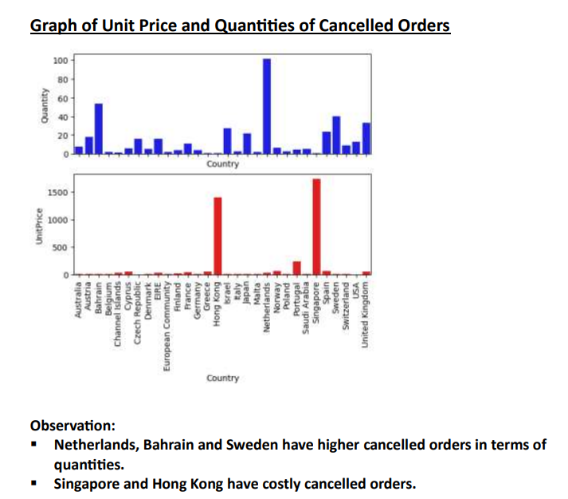

### Top 10 Selling Products
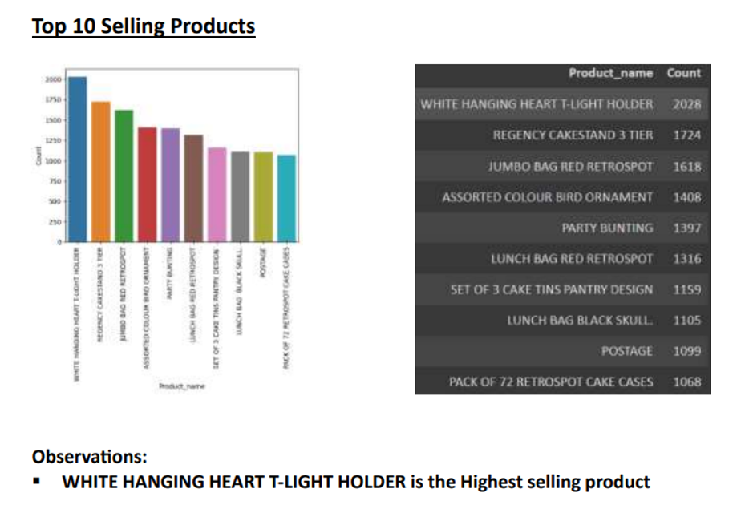

### Most Frequent Customers
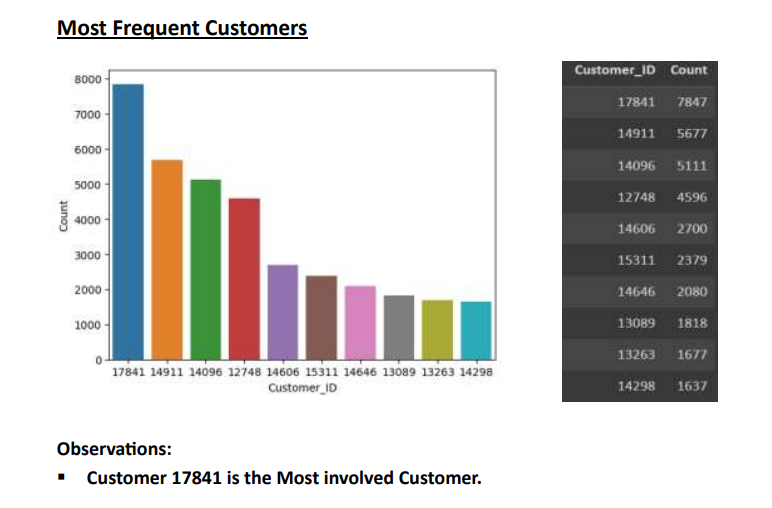

### Top 5 Countries with Count of Unique Customers
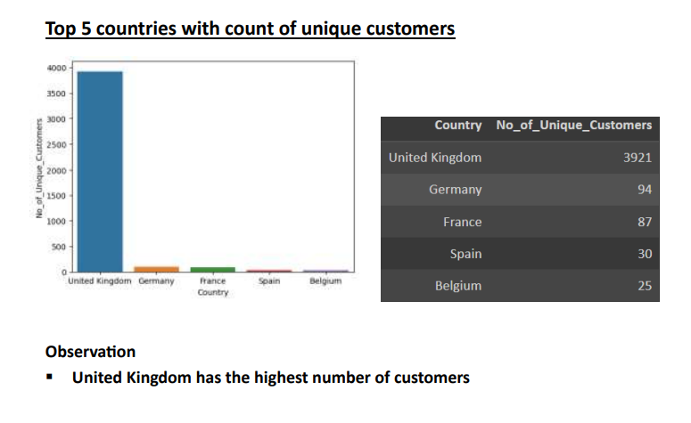

### Top 5 Countries Based on Total Sales
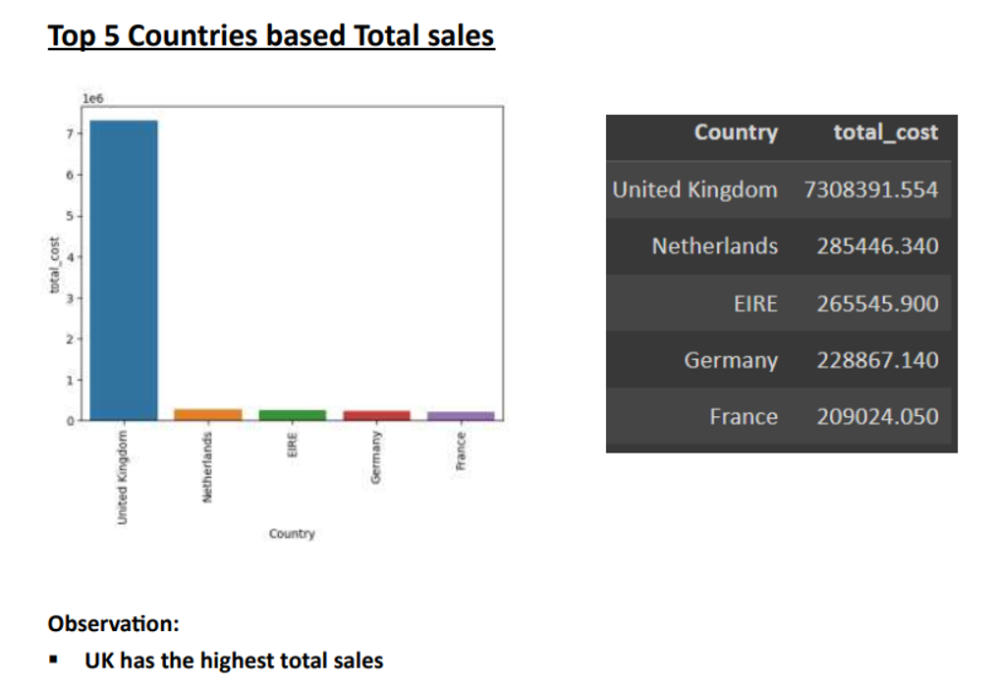

### Top 5 Countries with the Least Number of Customers
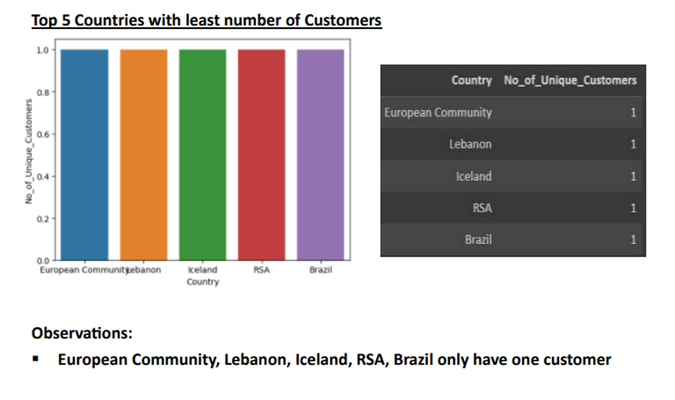

### Top 5 Countries with the Highest Number of Transactions
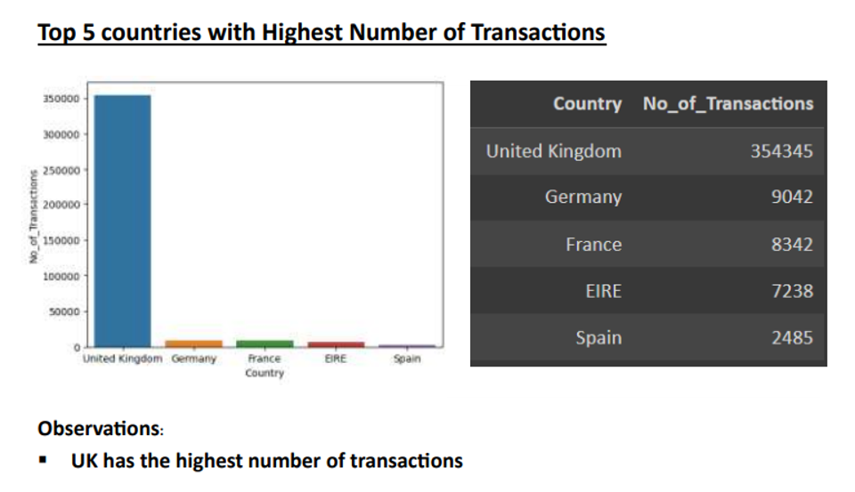

### Top 5 Countries with the Lowest Number of Transactions
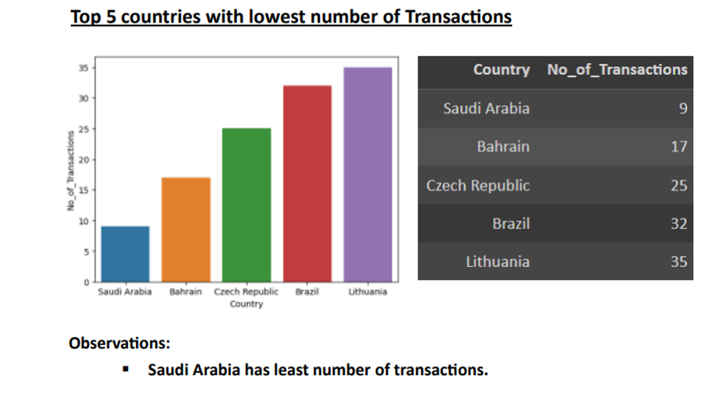

### Monthly Sales
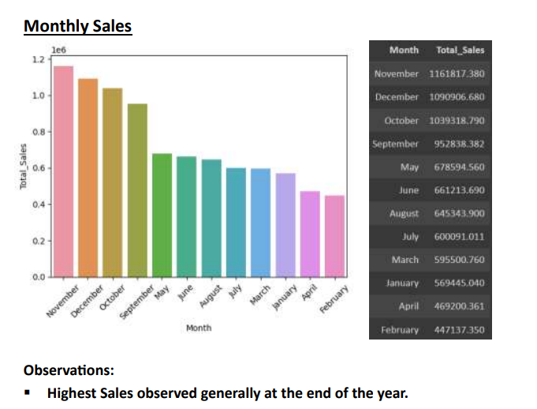

### Weekly Sales
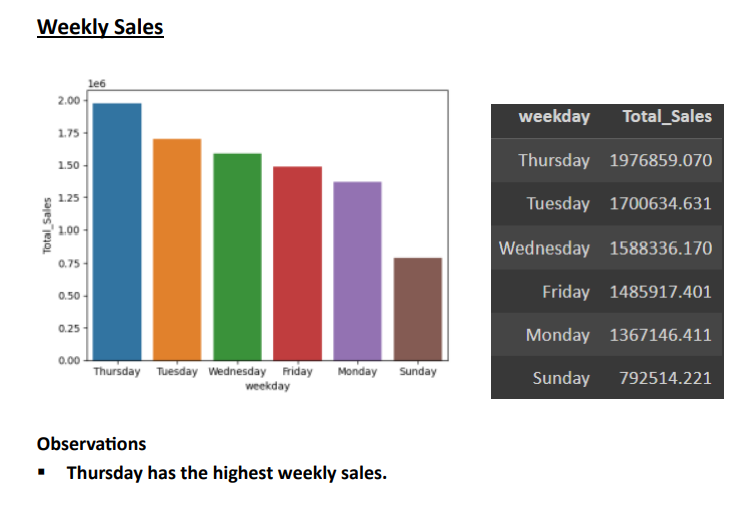

### Graph of Time of Day Sales
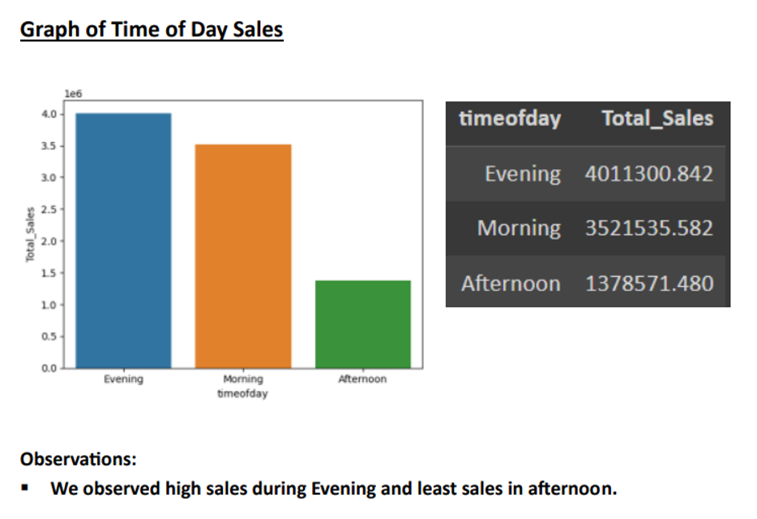

## Evaluation Metrics

### KMeans Model Metrics

| No of Clusters | Sum of Squared Distances | Silhouette Score |
| -------------- | ------------------------ | ----------------- |
| 2              | 7632.92                  | 0.541             |
| 3              | 4437.18                  | 0.509             |
| 4              | 3373.87                  | 0.485             |
| 5              | 2790.04                  | 0.468             |
| 6              | 2392.27                  | 0.416             |
| 7              | 2043.24                  | 0.414             |
| 8              | 1828.11                  | 0.407             |
| 9              | 1646.52                  | 0.411             |
| 10             | 1480.23                  | 0.380             |

**Graphs:**
- **Elbow Method graph**
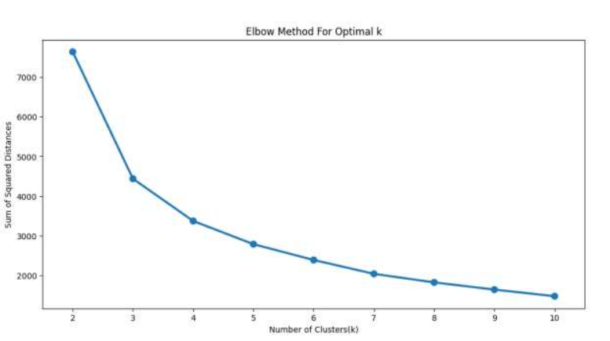
- **Silhouette Score graph**
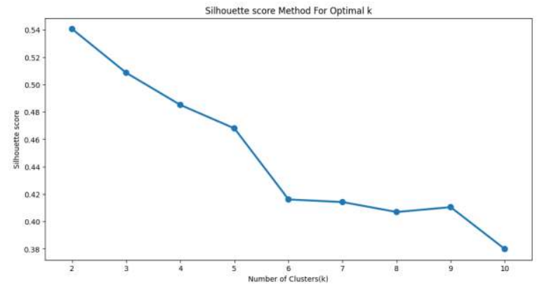

### DBSCAN Model Metrics

| Estimated No of Clusters | Estimated Number of Noise Points | Silhouette Score |
| ------------------------- | -------------------------------- | ----------------- |
| 2                         | 7632.92                            | 0.414             |

## Segmentation Result

- **3D Graph of KMeans Segmentation into 2 Clusters:**
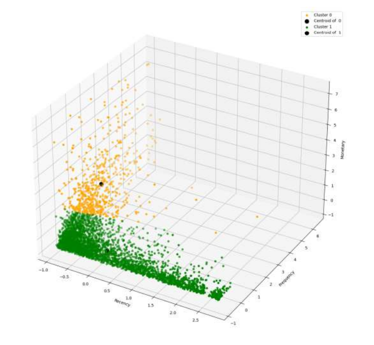

## Final Inference

  - **Cluster 0 (High-Value Customers):** Recent, frequent, and high-spending customers.
  - **Cluster 1 (Medium-Value Customers):** Recent, less frequent, and moderate-spending customers.

## License

This project is licensed under the [MIT License](LICENSE).

## How to Use

1. Clone the repository.
2. Install the required dependencies.
3. Run the Jupyter Notebook or Python script.
